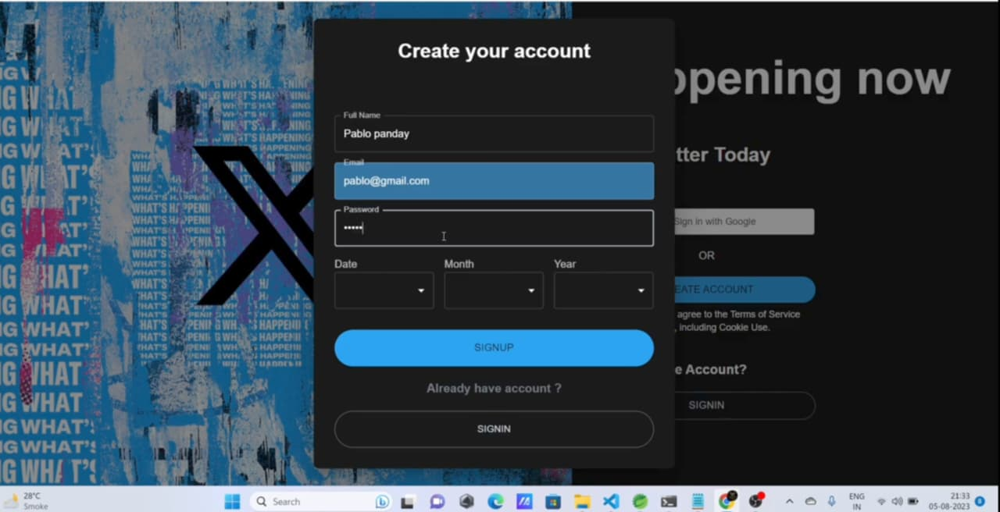
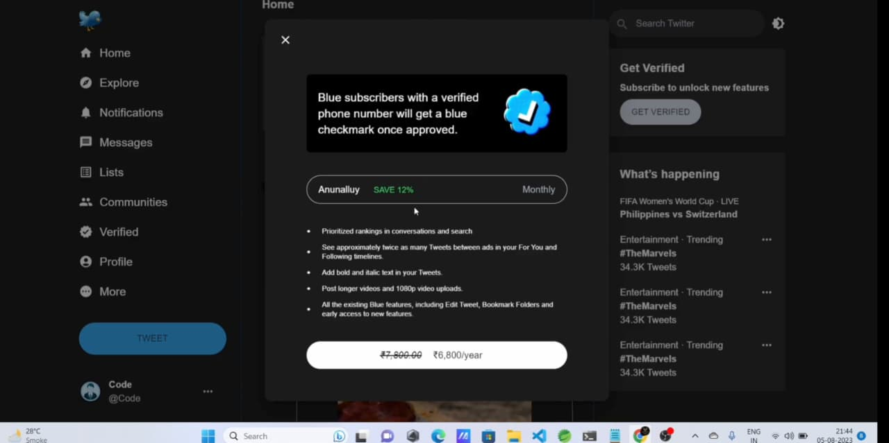
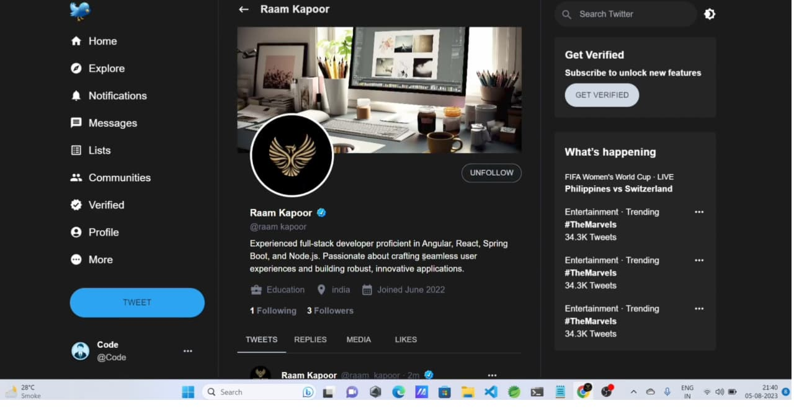

# 🐦 Twitter Clone

A full-stack social media platform inspired by Twitter/X, built with **Spring Boot and React**. The application supports user authentication, social interactions, multimedia posts, user profiles, search, and paid verification.

The platform provides a complete social-media experience with separate frontend and backend layers, JWT-based authentication, Google authentication, Cloudinary-powered media uploads, and Stripe integration for verified accounts.

## 🚀 Features

### 🔐 Authentication

* User registration and sign in
* JWT-based authentication
* Google authentication
* Spring Security 3 integration
* Secure authenticated API access

### 👤 User Features

* View and update user profile details
* Search for users
* View user profiles
* Follow and interact with tweets and users
* Dark and light theme support

### 📝 Posts & Media

* Create text-based tweets
* Create image posts
* Create video posts
* Add emojis to tweets
* Delete tweets
* Fetch tweets for the home/FYP feed

### 💬 Social Interactions

* Like tweets
* Comment on tweets
* Retweet tweets
* View tweets from other users
* Personalized feed / FYP

### ⭐ Twitter Verification

* Paid account verification
* Stripe payment integration
* Verified status for users after successful payment

### ☁️ Media Uploads

* Image and video uploads using **Cloudinary**
* Cloud-hosted media used within posts

## 🛠️ Tech Stack

### Backend

* **Java**
* **Spring Boot**
* **Spring MVC**
* **Spring Security 3**
* **Spring Data JPA**
* **JWT**
* **MySQL**

### Frontend

* **React**
* **Redux**
* **JavaScript**
* Responsive UI
* Dark / Light theme

### External Services

* **Cloudinary** — image and video uploads
* **Stripe** — paid account verification
* **Google Authentication** — Google sign-in

## 🏗️ Application Architecture

```text
                    ┌──────────────────────┐
                    │        React         │
                    │      + Redux         │
                    │                      │
                    │ Dark / Light Theme   │
                    │ User Interface       │
                    └──────────┬───────────┘
                               │
                          REST APIs
                               │
                               ▼
                    ┌──────────────────────┐
                    │     Spring Boot      │
                    │     Spring MVC       │
                    │                      │
                    │ Spring Security 3    │
                    │ JWT Authentication   │
                    │ Business Logic       │
                    │ REST Controllers     │
                    └──────────┬───────────┘
                               │
                         JPA / Hibernate
                               │
                               ▼
                    ┌──────────────────────┐
                    │        MySQL         │
                    │    Relational DB     │
                    └──────────────────────┘

             ┌────────────────┐   ┌────────────────┐
             │   Cloudinary   │   │     Stripe     │
             │ Media Uploads  │   │ Verification   │
             └────────────────┘   └────────────────┘
```

The React frontend communicates with the Spring Boot backend through REST APIs. Redux is used for frontend state management, while Spring Security and JWT handle authentication and protected API access.

Cloudinary is used to store and serve uploaded media, while Stripe handles the payment flow for account verification.

## 📸 Screenshots

### User Registration



### Account Verification



### User Profile



### Home / FYP


## 🔑 Core User Flows

### User Authentication

```text
Register
   ↓
Sign In
   ↓
JWT Authentication
   ↓
Authenticated User
```

Users can also authenticate through Google.

### Creating a Post

```text
Create Tweet
     ↓
Add Text / Emoji
     ↓
Optional Image / Video
     ↓
Upload Media to Cloudinary
     ↓
Publish Tweet
```

### Twitter Verification

```text
User chooses Verification
          ↓
      Stripe Payment
          ↓
   Successful Payment
          ↓
    Verified Account
```

## 📂 Project Structure

```text
TwitterCloneDeploy/
├── backend/
│   ├── src/
│   └── ...
│
├── frontend/
│   ├── src/
│   └── ...
│
└── README.md
```

## ⚙️ Getting Started

### Prerequisites

Make sure the following are installed:

* Java
* Maven
* Node.js
* npm
* MySQL

You will also need accounts/configuration for:

* Google Authentication
* Cloudinary
* Stripe

### 1. Clone the repository

```bash
git clone https://github.com/anshuman-borah/TwitterCloneDeploy.git

cd TwitterCloneDeploy
```

### 2. Configure MySQL

Create a MySQL database and configure the Spring Boot application with your database credentials.

```properties
spring.datasource.url=jdbc:mysql://localhost:3306/your_database
spring.datasource.username=your_username
spring.datasource.password=your_password
```

### 3. Configure external services

Configure the required credentials for:

* JWT
* Google Authentication
* Cloudinary
* Stripe

**Do not commit API keys, passwords, or other secrets to the repository.**

### 4. Start the backend

Navigate to the backend directory and run:

```bash
mvn spring-boot:run
```

### 5. Start the frontend

Navigate to the frontend directory:

```bash
npm install
npm start
```

## 🔗 Links

**Live Demo:**
https://twitter-clone-deploy-sigma.vercel.app/

**Source Code:**
https://github.com/anshuman-borah/TwitterCloneDeploy

## 📌 Project Highlights

* Full-stack social media application
* JWT authentication with Spring Security 3
* Google authentication
* Redux-based frontend state management
* Image and video posts
* Cloudinary media storage
* Likes, comments, and retweets
* User search and profile management
* Dark and light themes
* FYP / home feed
* Paid Twitter verification using Stripe
* RESTful Spring Boot backend
* MySQL relational database

## 👨‍💻 Author

**Anshuman Borah**

* GitHub: https://github.com/anshuman-borah
* LinkedIn: https://linkedin.com/in/anshuman15
